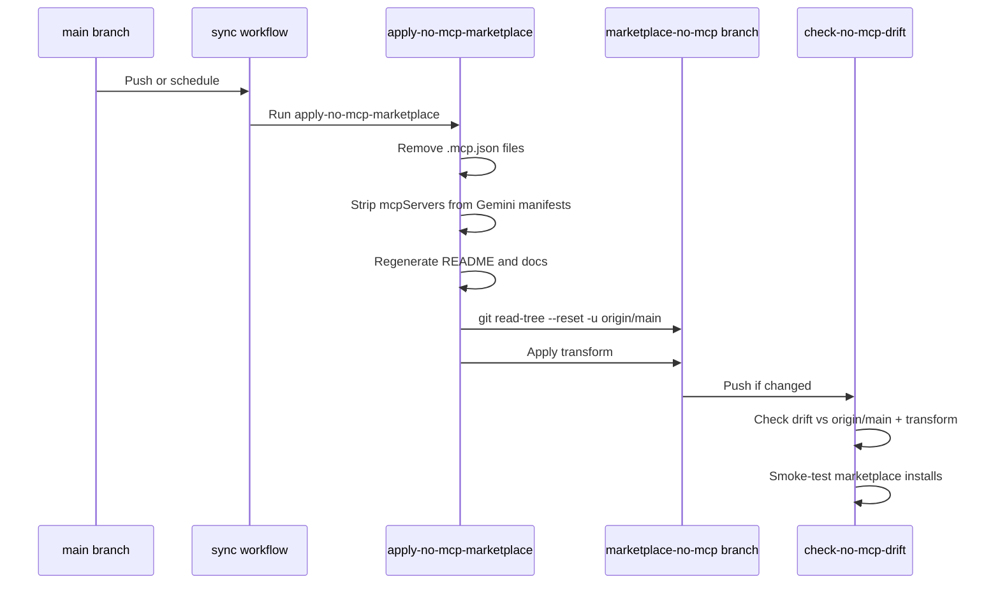

# Marketplace Model

Dendrite maintains two marketplace branches to support different installation scenarios:

- **`main`**: The canonical full marketplace with MCP server registrations included
- **`marketplace-no-mcp`**: A generated variant without bundled MCP server registrations

This dual-branch model lets users choose between a full-featured marketplace and a skills-only catalog that avoids MCP context overhead or integrates with existing MCP gateways.

## Branch Structure

### `main` Branch

The `main` branch is the default marketplace for normal users. It includes:

- Plugin metadata and manifests
- Skills and companion files
- MCP server registrations (`.mcp.json` files) where useful
- Gemini extension manifests with `mcpServers` entries

When you install from `main`, plugins that own MCP servers register those servers automatically in your agent runtime.

### `marketplace-no-mcp` Branch

The `marketplace-no-mcp` branch is a **deterministic transform** of `main` that removes:

- All `.mcp.json` files
- `mcpServers` entries from Gemini extension manifests

It preserves the same plugin and skill catalog, so capabilities remain available through fallback paths where supported (MCP first, then CLI, then direct HTTP calls).

**Use the no-MCP variant when:**
- You want skills and plugins without bundled MCP tool definitions
- You already run MCP servers through a separate MCP gateway or aggregator
- You want to avoid MCP context overhead in your agent runtime

### Installation

Install the full marketplace:
```bash
claude plugin marketplace add jmagar/dendrite
codex plugin marketplace add jmagar/dendrite
```

Install the no-MCP variant:
```bash
claude plugin marketplace add 'jmagar/dendrite#marketplace-no-mcp'
codex plugin marketplace add jmagar/dendrite --ref marketplace-no-mcp
```

## Synchronization Workflow

The `marketplace-no-mcp` branch is **automatically synchronized** from `main` via CI/CD:



The sync workflow lives at [`.github/workflows/sync-marketplace-no-mcp.yml`](.github/workflows/sync-marketplace-no-mcp.yml) and runs:

1. On every push to `main`
2. On a daily schedule (cron)
3. On manual workflow dispatch

### Transform Process

The transform is implemented by [`plugins/scripts/apply-no-mcp-marketplace`](plugins/scripts/apply-no-mcp-marketplace) and:

1. Takes `main`'s tree wholesale (`git read-tree --reset -u origin/main`)
2. Removes all `.mcp.json` files
3. Strips `mcpServers` entries from `gemini-extension.json` files
4. Regenerates the README inventory and generated docs
5. Validates both marketplace manifests
6. Pushes the branch only when the transform produces a change

This approach is conflict-proof: the transform is deterministic, so taking `main`'s tree and re-deriving avoids merge conflicts on every generated file.

### Drift Detection

The [check-no-mcp-drift workflow](.github/workflows/check-no-mcp-drift.yml) runs on schedule and manual dispatch to:

- Compare `origin/marketplace-no-mcp` with `origin/main` plus the deterministic no-MCP transform
- Smoke-test marketplace installs from both refs
- Report any drift or validation failures

You can check drift locally:
```bash
plugins/scripts/check-no-mcp-drift --compare-ref
```

## MCP-Backed Remote Entries

When a remote MCP-backed marketplace entry also publishes a `marketplace-no-mcp` ref, add its plugin name to the `NO_MCP_REF_NAMES` array in [`plugins/scripts/apply-no-mcp-marketplace`](plugins/scripts/apply-no-mcp-marketplace).

This tells the transform to expect a no-MCP ref for that plugin and use it instead of attempting to remove MCP config from the main ref.

**Never hand-edit `marketplace-no-mcp` as the primary fix.** Change `main` and the transform, then let the sync workflow publish the derived branch.

## Repository Rules

From [CLAUDE.md](CLAUDE.md#long-lived-branches):

- Do not merge `marketplace-no-mcp` into `main` by default
- `marketplace-no-mcp` is a deterministic transform of `main`, not a separate content branch
- Just push to `main` — the no-MCP branch is automatic
- The pre-push hook does not block `main` pushes on no-MCP drift
- Direct pushes to `marketplace-no-mcp` must be followed by `check-no-mcp-drift --compare-ref`
- Keep the transform deterministic; update `NO_MCP_REF_NAMES` instead of editing the branch

## Related Documentation

- [Operations](operations.md): How to add, update, or remove marketplace entries
- [Automation](automation.md): CI/CD workflows and validation scripts
- [Plugin Structure](plugin-structure.md): Plugin manifests and MCP registrations
